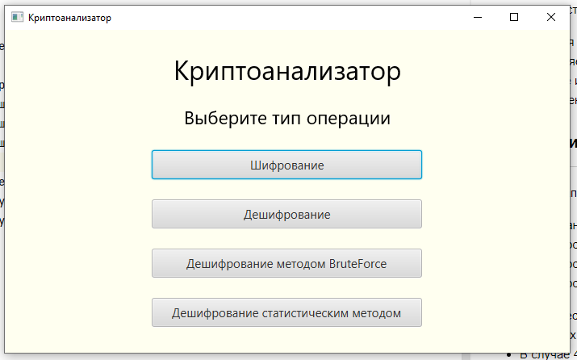
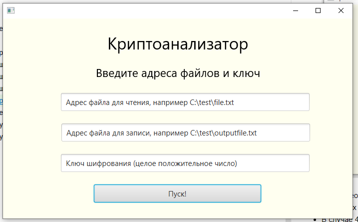
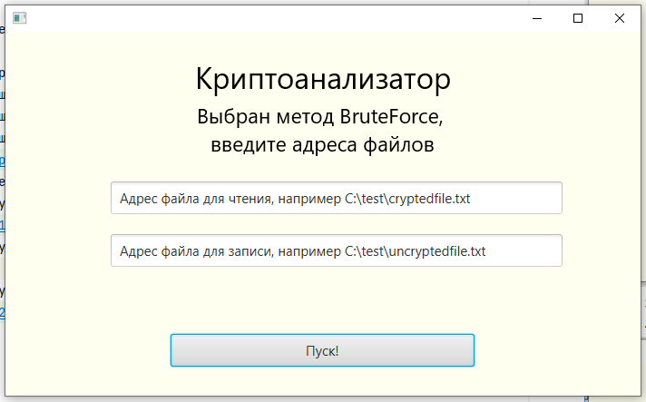
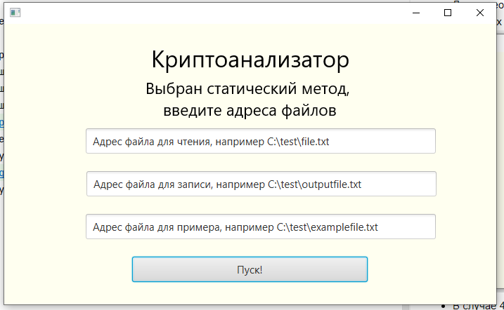

## Криптоанализатор шифром Цезаря

Шифр Цезаря, также известный как шифр сдвига — один из самых простых и наиболее широко известных методов шифрования.

Шифр Цезаря — это вид шифра подстановки, в котором каждый символ в открытом тексте заменяется символом, находящимся на
некотором постоянном числе позиций (**ключ**) левее или правее него в алфавите. Например, в шифре со сдвигом вправо на
3, А была бы заменена на Г, Б станет Д, и так далее.

### Инструкция

---

* После запуска программы необходимо выбрать тип операции:

1. шифрование с заданым **ключом**;
2. расшифровка с известным **ключом**;
3. расшифровка методом BruteForce;
4. расшифровка статистическим методом.

* Далее необходимо ввести адреса файлов для чтения и записи.
* В случаях 1 и 2 необходимо дополнительно задать **ключ**.

* В случае 3.

* В случае 4 необходимо дополнительно ввести адрес файла для примера.

